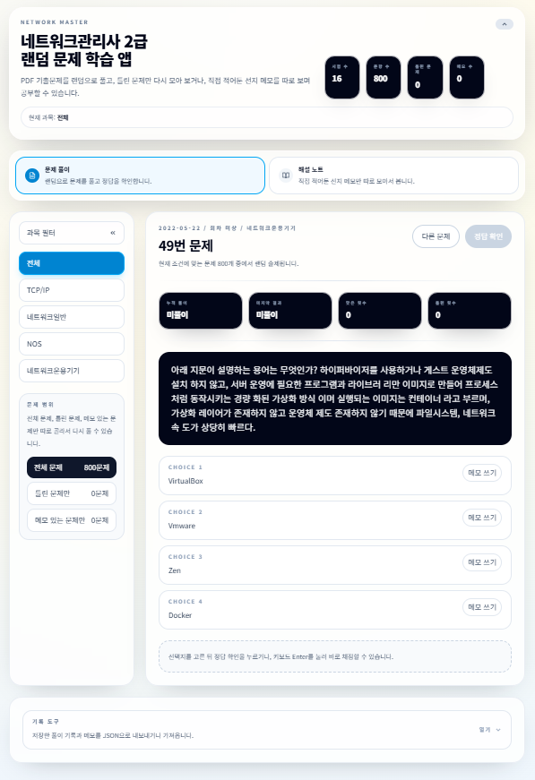

# network_master


- 네트워크관리사 2급 기출 PDF를 랜덤 문제 풀이 형태로 연습할 수 있게 만든 학습용 웹앱입니다.  
- 문제를 랜덤으로 풀고, 틀린 문제만 다시 보거나, 직접 적어둔 선지 메모를 따로 모아서 복습할 수 있습니다.  
- 모바일 UI도 지원하지만, 가급적 PC 환경에서 사용하는 것을 권장합니다.

## 주요 기능

- PDF 기출문제를 JSON 데이터로 변환해 문제를 랜덤 출제
- 과목별 필터
- `전체 문제 / 틀린 문제만 / 메모 있는 문제만` 출제 필터
- 문제별 풀이 기록 저장
- 선택지별 해설 메모 저장
- 해설 노트 페이지에서 메모만 따로 모아 보기
- 해설 노트 검색 기능
- 해설 노트 `5개 / 10개 / 20개씩 보기` 페이지네이션
- `Tab` 기반 다음 문제 이동 확인 팝업
- 기록 JSON 내보내기 / 가져오기
- S3 정적 호스팅 배포 지원
- 로컬 개발 실행 지원

## 배포 방식

이 프로젝트는 서버 DB 없이 브라우저 `localStorage`에 사용자 기록을 저장하는 정적 웹앱입니다.

따라서 운영 배포는 컨테이너 서버보다 `S3 + CloudFront` 같은 정적 호스팅 구성이 더 단순합니다.

- 앱 배포: `npm run build` 결과물인 `dist/` 업로드
- 사용자 기록: 각자 브라우저 `localStorage`에 저장
- 기록 이전: 앱 내 `JSON 내보내기 / 가져오기` 사용

주의할 점:

- 브라우저 데이터 삭제 시 기록도 함께 삭제됩니다.
- 다른 브라우저나 다른 기기와는 자동 동기화되지 않습니다.
- 배포 도메인 또는 경로가 바뀌면 기존 `localStorage` 기록이 이어지지 않을 수 있습니다.

## 실행 방법

### 로컬에서 실행 (권장)

개발과 확인은 기본적으로 로컬 Vite 서버에서 진행합니다.

```bash
npm install
npm run dev
```

브라우저에서 아래 주소로 접속합니다.

> <http://localhost:5173>

### 배포 빌드

```bash
npm run build
```

빌드 결과물은 `dist/` 폴더에 생성되며, 이 폴더를 S3에 업로드해 배포합니다.

### Docker 실행

Docker는 배포 필수 요소가 아니라, 정적 빌드 결과를 컨테이너로 확인하거나 데이터 생성 스크립트를 격리 실행할 때 사용하는 보조 경로입니다.

```bash
docker compose up --build
```

브라우저에서 아래 주소로 접속합니다.

> <http://localhost:4173>

## 사용 방법



### 1. 과목 선택

왼쪽 사이드바에서 과목을 선택하면 해당 과목 문제만 볼 수 있습니다.

- 전체
- TCP/IP
- 네트워크일반
- NOS
- 네트워크운용기기

### 2. 문제 풀이

선택지를 고른 뒤 `정답 확인`을 누르면 결과가 표시됩니다.  
선택지를 고른 상태에서는 `Enter` 키로도 정답 확인이 가능합니다.

정답 확인 후 `Tab` 키를 누르면 `다음 문제로 넘어가시겠습니까?` 팝업이 뜹니다.

- `확인` 클릭 또는 `Enter`: 다음 문제로 이동
- `취소` 클릭 또는 `Esc`: 현재 문제 유지

### 3. 출제 범위 선택

문제 범위 카드에서 아래 세 가지 모드 중 하나를 선택할 수 있습니다.

- 전체 문제
- 틀린 문제만
- 메모 있는 문제만

현재 선택한 과목 기준으로 문제 수가 표시됩니다.

### 4. 선지 메모 작성

각 선택지 오른쪽의 `메모 쓰기` 또는 `메모 보기` 버튼을 눌러 메모를 열 수 있습니다.  
헷갈리는 포인트나 직접 정리한 해설을 저장해 두면 나중에 다시 확인할 수 있습니다.

### 5. 해설 노트 보기

상단의 `해설 노트` 탭으로 이동하면 메모가 있는 문제만 따로 모아서 볼 수 있습니다.

- 같은 문제에 메모가 여러 개 있으면 한 카드에 묶어서 표시
- 정답 선지 / 오답 선지 표시
- `메모 있는 문제만 다시 풀기` 버튼으로 바로 복습 가능
- 오른쪽 상단 검색 버튼으로 메모 검색창 열기 가능
- 문제 본문, 선택지, 메모 내용으로 검색 가능
- `5개 / 10개 / 20개씩 보기`와 페이지 이동 지원

### 6. 기록 저장 방식

풀이 기록과 메모는 브라우저의 `localStorage`에 저장됩니다.

- 같은 브라우저에서는 새로고침 후에도 유지됩니다.
- 다른 PC로 옮기려면 `기록 도구`에서 JSON을 내보내고 가져오면 됩니다.

### 7. 기록 내보내기 / 가져오기

하단 `기록 도구`를 열면 기록을 JSON으로 복사하거나 다른 PC 기록을 가져올 수 있습니다.

- `전체 복사`: 현재 기록을 클립보드에 복사
- `기록 적용하기`: 가져온 JSON을 기존 기록과 병합

잘못된 JSON이면 저장되지 않습니다.

## 데이터 범위

- 수록 회차: 2022년 ~ 2025년
- PDF 수: 16개
- 총 문항 수: 800문항

## 개발 문서

개발 환경, S3 정적 배포 흐름, PDF -> JSON 변환 흐름, Docker 보조 사용, 로컬 저장 구조는 아래 문서를 참고하면 됩니다.

- [개발자 문서](/docs/DEVELOPER_GUIDE.md)
